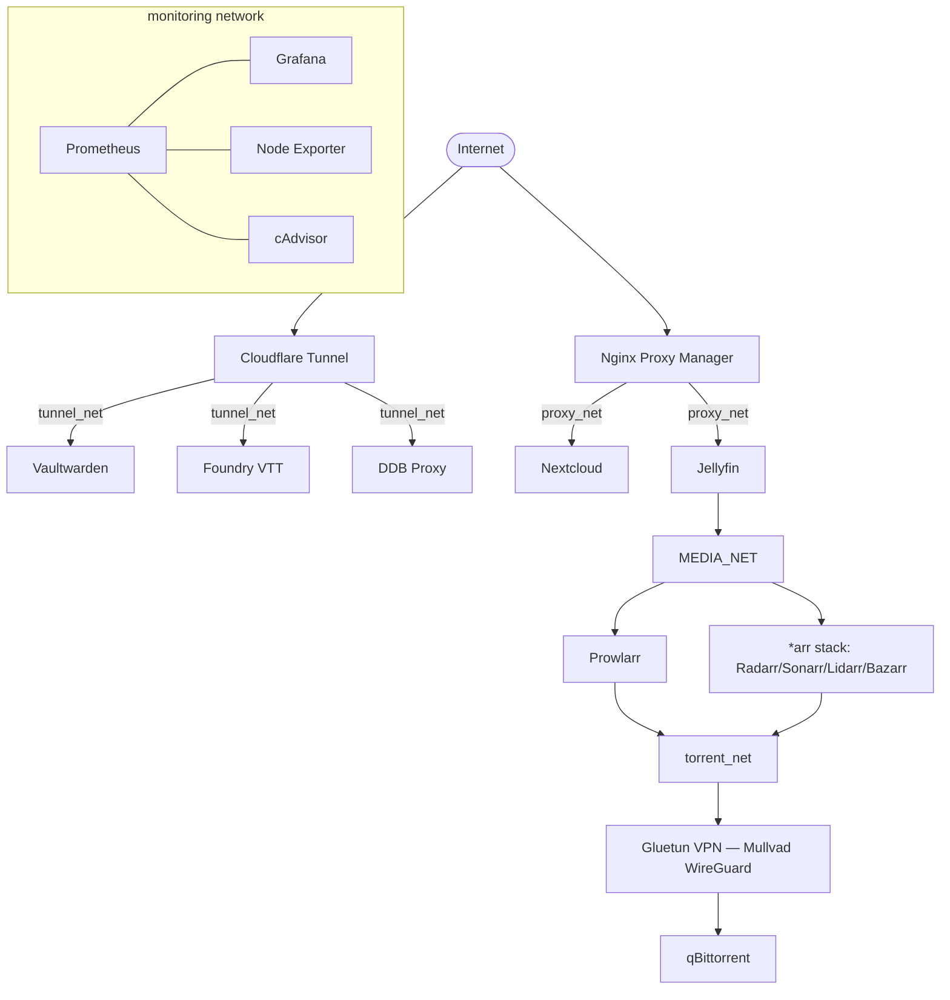

# Gaia Homelab — Infrastructure as Code

[](../../actions)
[](../../actions)
[](../../actions)
[](../../actions)
[](LICENSE)

> This is my home server, managed entirely through Ansible and Terraform instead of manual setup. I built it to practice the workflows I'd actually use in a DevOps/SysAdmin role — idempotent config, secrets handling, CI gating, staging before prod — while learning the field on my own.

---

## Table of Contents
- [Why this project exists](#why-this-project-exists)
- [Architecture](#architecture)
- [Security design decisions](#security-design-decisions)
- [Tech stack](#tech-stack)
- [Repository structure](#repository-structure)
- [CI/CD pipeline](#cicd-pipeline)
- [Test-before-prod workflow](#test-before-prod-workflow)
- [Getting started](#getting-started)
- [Lessons learned / trade-offs](#lessons-learned--trade-offs)
- [Roadmap](#roadmap)
- [About me](#about-me)

---

## Why this project exists

I'm self-taught in DevOps/sysadmin practices and currently work in a non-technical support role. This repository is where I apply and practice the practices I'd expect to use on the job: idempotent config management, secrets handling, network segmentation, and a CI pipeline that actually gatekeeps changes — instead of a wiki page of manual steps.

Everything here manages a real, currently-running home server (Ubuntu + Docker), not a toy demo.

## Architecture



Traffic is split by trust boundary into isolated Docker networks:

| Network | Purpose |
|---|---|
| `proxy_net` | Public-facing services routed through Nginx Proxy Manager |
| `tunnel_net` | Internal services published via Cloudflare Tunnel (no open inbound ports) |
| `media_net` | Media server ↔ media request/management apps |
| `torrent_net` | Download stack — **all traffic forced through the Gluetun VPN container**, no direct internet path |
| `monitoring` | Metrics collection, isolated from application traffic |

## Security design decisions

Rather than list every tool, here's the *reasoning* behind the choices that matter most on review:

- **No secrets in plaintext.** All sensitive values live in `ansible-vault`-encrypted `vault.yml`; the vault password is resolved via `get-vault-pass.sh` (env var in CI, OS keyring locally) — same script, both environments.
- **Docker socket is never mounted directly.** Watchtower talks to a `tecnativa/docker-socket-proxy` container with a locked-down permission set (no `POST`, `BUILD`, `EXEC`, `DELETE`) instead of `/var/run/docker.sock`. cAdvisor runs privileged with direct docker.sock/cgroup access, per the upstream-recommended deployment — its metrics model requires this and isn't compatible with the read-only docker-socket-proxy pattern used elsewhere. It's isolated on the monitoring network with no other services depending on that access.
- **VPN kill-switch for torrent traffic.** qBittorrent shares Gluetun's network namespace (`network_mode: container:gluetun`) — if the VPN drops, the download client loses connectivity entirely rather than falling back to the host's real IP.
- **Admin UIs bound to loopback.** Nginx Proxy Manager's admin panel, Kopia's web UI, and the `*arr` dashboards are published on `127.0.0.1` only, not the LAN interface.
- **Host hardening.** UFW default-deny inbound, SSH restricted to key-based auth with `PermitRootLogin no`, kernel `sysctl` hardening (SYN cookies, disabled ICMP redirects).
- **CrowdSec** ingests Nginx/system logs and blocks malicious request patterns in near real time.

## Tech stack

| Layer | Tools |
|---|---|
| Configuration management | Ansible, Ansible Vault |
| Infrastructure provisioning | Terraform, libvirt/KVM |
| Containers | Docker, Docker Compose |
| Reverse proxy / ingress | Nginx Proxy Manager, Cloudflare Tunnel |
| Monitoring | Prometheus, Grafana, Node Exporter, cAdvisor |
| Security | UFW, CrowdSec, Docker Socket Proxy, Gitleaks, Trivy |
| CI/CD | GitHub Actions |

## Repository structure

```text
.
├── ansible/
│   ├── ansible.cfg
│   ├── site.yml                  # Main playbook
│   ├── get-vault-pass.sh         # Resolves vault password (CI env var / local keyring)
│   ├── group_vars/
│   │   ├── all/vars.yml          # Shared variables
│   │   └── all/vault.yml         # Ansible Vault — encrypted secrets
│   ├── inventories/
│   │   ├── dev.ini               # Staging (generated by Terraform)
│   │   └── prod.ini.example      # Template — real inventory kept out of git
│   └── roles/
│       ├── bootstrap/            # OS hardening, UFW, sysctl, Docker Engine
│       ├── system/                # Watchtower, CrowdSec, Kopia backups, docker-proxy
│       ├── connection/            # Nginx Proxy Manager, Cloudflare Tunnel
│       ├── vaultwarden/
│       ├── nextcloud/
│       ├── media/                 # Jellyfin, *arr stack, Gluetun VPN, qBittorrent
│       ├── monitoring/            # Prometheus, Grafana, exporters
│       └── foundry/                # Foundry VTT
├── terraform/dev/                # Disposable KVM staging VM for pre-prod testing
└── .github/workflows/            # Lint, syntax check, secret scan, config scan, terraform CI
```

## CI/CD pipeline

Every push/PR runs:

| Workflow | What it checks |
|---|---|
| `ansible-lint.yml` | Ansible best-practice linting (`production` profile) |
| `ansible-syntax.yml` | Playbook syntax validation |
| `secret-scan.yml` | Gitleaks — fails the build if a secret is ever committed |
| `security-scan.yml` | Trivy config scan for CRITICAL/HIGH misconfigurations |
| `terraform.yml` | `terraform fmt -check`, `init`, `validate` on any Terraform change |

## Test-before-prod workflow

Changes aren't applied directly to the production host. `terraform/dev` provisions a throwaway Ubuntu VM on local KVM/libvirt, auto-generates its Ansible inventory, and the same `site.yml` playbook runs against it first:

```bash
cd terraform/dev
terraform apply                 # spins up a disposable staging VM, writes ansible/inventories/dev.ini
cd ../../ansible
ansible-playbook site.yml -i inventories/dev.ini --ask-vault-pass
```

Once verified, the identical playbook targets production:

```bash
ansible-playbook site.yml -i inventories/prod.ini --ask-vault-pass --limit homelab
```

## Getting started

**Requirements:** Ansible, the `community.docker` and `community.general` collections, Terraform + libvirt (for staging only).

```bash
ansible-galaxy collection install community.docker community.general
```

Copy `ansible/inventories/prod.ini.example` to `prod.ini` and fill in your own hosts, then run as shown above. A vault password is required — either export `ANSIBLE_VAULT_PASSWORD` or store it in your OS keyring (see `get-vault-pass.sh`).

## Lessons learned / trade-offs

A few decisions here are trade-offs I made consciously, not things I overlooked:

Most images run on `:latest` with Watchtower auto-updating them. That's convenient for a single-operator homelab, but I'm aware it's non-reproducible — a container can pull a breaking change overnight with no warning. In a team/production setting I'd pin versions and roll out updates deliberately instead of letting them apply themselves.

Terraform state is kept local, with no remote backend or locking. That's fine as long as I'm the only one touching this infrastructure, but it wouldn't hold up with more than one contributor — I'd move to a remote backend (S3 + DynamoDB lock, or Terraform Cloud) the moment that changed.

Kopia's backup container runs as root. It needs to read appdata directories owned by a different UID per service (Nextcloud, Prometheus, the *arr stack, etc.), and giving it root was simpler than maintaining a per-service permission matrix. A narrower setup is on my list, just not urgent for a single-host backup job.

## Roadmap

- [ ] Pin container image versions; move to scheduled, reviewed updates
- [ ] Remote Terraform backend with state locking
- [ ] Molecule tests for Ansible roles
- [ ] Alertmanager rules on top of the existing Prometheus/Grafana stack

## About me

Self-taught in DevOps/sysadmin practices, currently working as a Support Associate. Background in front-end development (AP Degree, Multimedia Design, IBA — Denmark). Looking for a junior/mid-level DevOps or SysAdmin role.

- LinkedIn: https://www.linkedin.com/in/oliver-novos%C3%A1d-59a135223/
- Email: oliver.novosad@gmail.com
